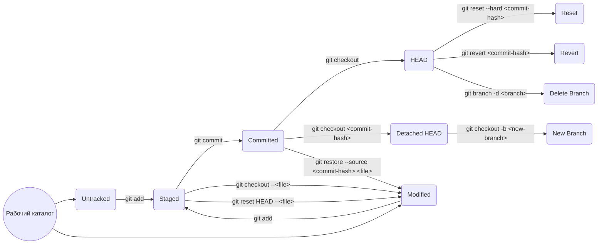

# Git Шпаргалка

## Настройка

### Создание репозитория

```bash
git init
```

### Конфигурация пользователя

```bash
git config --global init.defaultBranch <name>	# установка значения по умолчанию для имени ветки при создании нового репозитория (например, master/main/trunk/development)
git config --global user.name "Your Name"
git config --global user.email "youremail@example.com"
```

## Основные команды

### Работа с репозиторием

```bash
git remote add <name> <repository-url>  # Добавить удаленный репозиторий, `<name>` - имя, которое вы выбираете для удаленного репозитория
git clone <repository-url>              # Клонировать репозиторий
git status                              # Показать состояние рабочей директории
git remote -v                           # Показать список удаленных репозиториев
git add <file>                          # Добавить файл в индекс
git commit -m "Commit Message"          # Зафиксировать изменения в репозитории
git pull <name> <branch>                # Получить изменения с удаленного репозитория и объединить их с локальной веткой, `<branch>` - имя ветки, с которой вы хотите работать.
git push <name> <branch>                # Отправить локальные изменения на удаленный репозиторий
```

### Ветвление и слияние

```bash
git brach -M main      # Переименование текущей ветки (например, master -> main)
git branch             # Показать список локальных веток
git branch -r          # Показать список удаленных веток
git branch -a          # Показать список всех веток (локальных и удаленных)
git branch <branch>    # Создать новую ветку
git checkout <branch>  # Переключиться на указанную ветку
git merge <branch>     # Слить указанную ветку с текущей веткой
git branch -d <branch> # Удалить указанную ветку
```

### Лог и история

* Хеш коммита - это уникальный идентификатор коммита в Git.
* Git log позволяет просматривать историю коммитов в репозитории.
* Ключевые опции git log:  
    - --oneline: Компактный вывод истории коммитов в одну строку.  
    - --author: Фильт  
* HEAD - один из служебных файлов папки `.git`(указывает на последний сделанный коммит)  
    - -- Внутри HEAD - ссылка на служебный файл: `refs/heads/master(или main)`
    - -- HEAD можно использовать вместо хеша, если нужно передать последний коммит.

```bash
git log                # Показать историю коммитов
git log --oneline      # Компактный вывод истории коммитов
git diff               # Показать изменения в рабочей директории
git blame <file>       # Показать, кто вносил изменения в указанный файл
```

### Игнорирование файлов

Создайте файл `.gitignore` в корневой директории репозитория и добавьте туда шаблоны файлов/директорий, которые вы хотите игнорировать.

### Временное сохранение изменений
```bash
git stash              # Сохранить незакоммиченные изменения временно
```

### Жизненный цикл файлов в Git

* Untracked: Файл не отслеживается Git. Он находится в рабочем каталоге, но не в индексе и не был коммичен.
* Modified: Файл был изменен в рабочем каталоге, но изменения не были проиндексированы.
* Staged: Изменения в файле были проиндексированы с помощью команды `git add`.
* Committed: Проиндексированные изменения были зафиксированы с помощью команды `git commit`.
* Tracked: Файлы в которых Git так или иначе отслеживает изменения.



#### Краткое описание каждого шага

* A((Рабочий каталог)) - начальное состояние рабочего каталога.  
* A --> B(Untracked) - файлы, которые не были отслежены Git.  
* A --> C(Modified) - файлы, которые были изменены в рабочем каталоге.  
* B -- git add --> D(Staged) - добавление файлов в индекс (staging area) с помощью команды "git add".  
* C -- git add --> D - добавление измененных файлов в индекс.  
* D -- git commit --> E(Committed) - фиксация изменений в коммит с помощью команды "git commit".  
* E -- git checkout --> F(HEAD) - перемещение указателя HEAD на последний коммит.  
* E -- "git checkout &lt;commit-hash&gt;" --> G(Detached HEAD) - перемещение HEAD в режиме "Detached HEAD" на определенный коммит.  
* F -- "git reset --hard &lt;commit-hash&gt;" --> H(Reset) - сброс рабочего каталога и индекса до указанного коммита с помощью команды "git reset --hard".  
* F -- "git revert &lt;commit-hash&gt;" --> I(Revert) - создание нового коммита, который отменяет изменения, внесенные указанным коммитом, с помощью команды "git revert".  
* D -- "git checkout --&lt;file&gt;" --> C - отмена изменений файла, не добавленного в индекс, с помощью команды "git checkout".  
* D -- "git reset HEAD --&lt;file&gt;" --> C - удаление файла из индекса и отмена его изменений с помощью команды "git reset HEAD".  
* E -- "git restore --source &lt;commit-hash&gt; &lt;file&gt;" --> C - восстановление файла из указанного коммита и отмена его изменений с помощью команды "git restore".  
* G -- "git checkout -b &lt;new-branch&gt;" --> J(New Branch) - создание новой ветки на основе коммита, на котором находится "Detached HEAD", с помощью команды "git checkout -b".  
* F -- "git branch -d &lt;branch&gt;" --> K(Delete Branch) - удаление ветки с помощью команды "git branch -d".  
